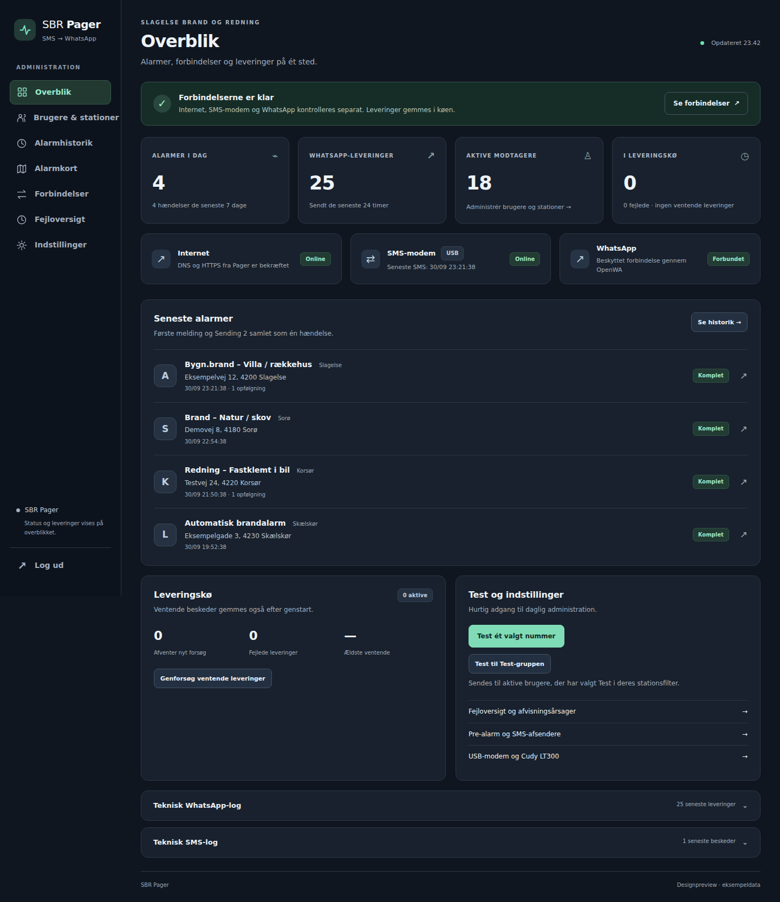

# SBR Pager · opdatering og Cudy LT300

Opdateringen bygger videre på `feature/sms-whatsapp-gateway` og bevarer
SIM800C USB-seriel, OpenWA-session, stationsvalg, Test opt-in og datavolumener.
Den er forberedt på branchen `codex/sms-whatsapp-review-cudy`.
Den bliver ikke automatisk installeret på racherserver.

## Opdater med dit nuværende USB-modem

Kør på **racherserver**, ikke racher-pi2:

```bash
cd /opt/SBR-Pager-Gateway
git status --short
git remote set-branches --add origin codex/sms-whatsapp-review-cudy
git fetch origin codex/sms-whatsapp-review-cudy
git switch codex/sms-whatsapp-review-cudy
git merge --ff-only origin/codex/sms-whatsapp-review-cudy
bash scripts/update-sbr-pager.sh
```

Hvis checkout afvises på grund af lokale kodeændringer, skal de først afklares.
Undlad `git reset --hard`. Den eksisterende `.env` er ignoreret af Git og beholdes.
Hvis `.env` ikke indeholder `SMS_MODEM_DRIVER`, bruges USB automatisk.
Behold den eksisterende `SMS_MODEM_HOST_DEVICE` og baudrate.

Scriptet tager konsistente SQLite-backups, kopierer `.env` til en beskyttet
backupmappe og tagger de to gamle images, før noget udskiftes. Det bygger og
validerer de nye images og pauser kun aktive watchdog-timere under genstarten.
OpenWA-containeren og dens login genskabes ikke. Hvis genstart/health fejler,
forsøger scriptet at starte de tidligere images igen.

Databasen udvides med en separat kildekvitteringstabel. Eksisterende tabeller
ændres ikke. SQLite foreign-key-kaskader er aktiveret i Pager, så sletning
også rydder tilhørende retry-state og kvalitetsbeslutninger.

Efter opdateringen vises modem, WhatsApp og kø på Overblik. En almindelig
testalarm skal behandles gennem det eksisterende Test opt-in; scriptet sender
ingen beskeder. `Send testbesked` i UI er en brugerhandling.

## Den planlagte drift: LT300 til internet og SMS

LT300 skal være primær forbindelse for **både internet og SMS**. Serverens
Ethernet-kabel tilsluttes routerens LAN-port. Serverens LAN-forbindelse sættes
til DHCP, så IP-adresse, standardgateway og DNS kommer fra LT300. Docker,
OpenWA og Tailscale bruger derefter serverens normale internetforbindelse;
programmet skal ikke selv konfigurere eller genstarte routerens netværk.

Cudys officielle emulator viser LAN-adressen `192.168.10.1` og DHCP med samme
standardgateway/DNS. Brug den faktiske adresse på din router. Opret gerne en
DHCP-reservation til serveren, så dens LAN-adresse er stabil. To netkort eller
Wi-Fi samtidigt kan give en anden foretrukken standardrute; kontrollér ruten,
før den gamle forbindelse frakobles.

Kør disse læsekontroller på serveren efter tilslutning:

```bash
ip -br addr
ip route
ip route get 1.1.1.1
resolvectl status
tailscale status
```

Kontrollér desuden, at serveren og OpenWA kan nå internettet, at Tailscale er
forbundet, og at en reel WhatsApp-test leveres. SMS-forbindelsestesten viser
SIM og mobilregistrering; den beviser ikke i sig selv, at internet virker.
Routerens AT-adapter sender ingen CFUN-, radio-reset- eller APN-kommandoer,
så SMS-recovery ikke bevidst afbryder internetforbindelsen.

USB er **midlertidig, manuel backup under indkøringen**, ikke den permanente
primære løsning. Behold USB-konfigurationen, indtil LT300 har bestået korte
og delte SMS'er, WhatsApp-levering og genstartstest. Med ét SIM kræver skift
mellem router og USB, at SIM-kortet flyttes. Automatisk failover ville kræve
separate SIM-kort/numre og en særskilt plan for alarmleveringen.

## Forbindelsesstatus, enkeltpersonstest og fejloversigt

Overblik og Forbindelser viser **Internet**, **SMS-modem** og **WhatsApp**
separat. Internet afprøves med DNS og HTTPS fra Pager-containeren; kontrollen
har to sekunders timeout pr. kontrolserver, bruger højst to servere og caches
i 30 sekunder. Standardkontrollen bruger Google gstatic og Cloudflare med
HEAD-forespørgsler. Adresser kan ændres i Compose-miljøet med
`SMS_WHATSAPP_INTERNET_CHECK_URLS` (højst to kommaseparerede HTTPS-adresser).
En fungerende kontrol beviser forbindelse til kontrolserveren; den beviser
ikke i sig selv, at WhatsApp virker eller at en besked når telefonen.

**Test ét valgt nummer** åbner en side med aktive brugere. Vælg én bruger og
tryk Send. Dette er en udtrykkelig manuel test til det valgte nummer, også
hvis brugeren ikke har valgt Test i stationsfilteret. Den eksisterende knap
**Test til Test-gruppen** er stadig separat og bruger gruppens Test-opt-in.

Enkeltpersonstesten gemmes før HTTP-kvitteringen og køres af den eksisterende
leveringsworker efter almindelige alarmjobs. Et dobbeltklik/genforsøg af
samme formular skaber ikke en ny afsendelse. Testen udløber efter fem minutter
i køen, og en pauset, slettet eller ændret modtager får den ikke. Der er ingen
automatisk genudsendelse af fejlede eller usikre testforsøg.

Siden opdaterer resultatet hvert femte sekund med OpenWA-besked-id og svartid
fra afsendelsesforsøget til OpenWA svarer. **Det er en OpenWA-kvittering,
ikke en leverings- eller læsekvittering fra telefonen.** Hvis processen
stoppede under afsendelsen, vises Uafklaret, og telefonen skal kontrolleres
før en ny manuel test. Ingen fysisk SMS fra LT300 afsendes med denne knap.
Prøv indgående SMS fra en telefon til routerens SIM som beskrevet nedenfor.

**Fejloversigt** viser de seneste 50 indgående SMS med gemte beslutninger og
de seneste 50 leveringer med problemer. Afsenderafvisning, modemstøj og
manglende stationsvalg gemmes ved behandlingen og ændres ikke, hvis
indstillingerne senere ændres. En SMS uden valgte modtagere bliver ikke
pludselig sendt ved en gentagen import efter tilføjelse af nye modtagere.
Ældre beskeder uden en gemt årsag beskrives som ukendte. Åbning af siden
udfører ingen afsendelser eller internetkontrol.

Databasen får en ekstra `single_whatsapp_test`-tabel; eksisterende tabeller
ændres ikke. Den gamle image-rollback kan fortsat bruge de samme volumener.

## Videresend fra alle telefonnumre

Under **Indstillinger → Afsenderfilter** findes afkrydsningsboksen
**Videresend SMS fra alle telefonnumre**. Ændringen gemmes automatisk og
bevares efter genstart. Listen med godkendte numre bruges igen, når feltet
slås fra. Den eksisterende liste slettes ikke.

Indstillingen åbner kun afsendergodkendelsen. Stationsvalg, Test-opt-in,
modemstøjsfilter og de særskilte SMS-statuskommandoer gælder fortsat.
Almindelig SMS uden stationskode sendes til aktive modtagere med
**Alle stationer**. Tidligere afviste beskeder bliver ikke genudsendt.
Både USB og LT300 bruger denne samme indstilling.

## Udgående SMS via LT300: afventer firmwaretest

Målet er, at LT300 også sender udgående SMS og status-svar. Det er endnu ikke
implementeret eller bekræftet via routerens firmware. Cudys guide beskriver
SMS-funktioner, men den offentlige LT300-emulator dokumenterer ikke en
anvendelig grænseflade til afsendelse fra vores program. En AT-webformular
beviser heller ikke, at en interaktiv CMGS-afsendelse kan gennemføres.

Når routeren er tilgængelig, skal model/firmware registreres, og en eventuel
indbygget SMS-afsendelse prøves manuelt. Derefter kan den faktiske
HTTP-/AT-afsendelsesmetode implementeres og prøves med dansk tegnsæt,
korte/lange beskeder, en reel modemkvittering og afsendelse uden internet.
Programmet må først markere en SMS som sendt ved bekræftet modemkvittering.
Indtil da afviser Cudy-driveren nye udgående SMS tydeligt og beholder de gamle
USB-jobs. USB kan vælges manuelt til afsendelse under indkøringen.

## Forbered Cudy uden at skifte fra USB

Cudy dokumenterer SMS og AT-kommandoer i
[LT300-guiden](https://docs.cudy.com/user_guide/4g5g_router/lt300/).
Adapterens felter og login følger den officielle
[LT300-emulator](https://support.cudy.com/emulator/LT300/) og dens
[sysauth.js](https://support.cudy.com/emulator/LT300/luci-static/bootstrap/js/sysauth.js).
Dette er en firmwareafhængig webgrænseflade; fysisk routertest mangler endnu.

Tilslut SIM og Ethernet. Kontrollér, at Cudys egen side kan modtage SMS.
Tilføj følgende i `/opt/SBR-Pager-Gateway/.env`, med din egen adgangskode:

```dotenv
SMS_MODEM_DRIVER=usb
CUDY_BASE_URL=http://192.168.10.1
CUDY_USERNAME=admin
CUDY_PASSWORD=DIN_ROUTER_ADGANGSKODE
CUDY_HTTP_TIMEOUT_SECONDS=15
CUDY_POLL_SECONDS=5
```

Brug routerens faktiske LAN-IP. Hvis adgangskoden indeholder `$`, `#` eller
andre dotenv-specialtegn, anvend enkelt anførselstegn i `.env` omkring værdien.
Filen og backupkopierne må ikke deles eller committes.

Genskab Gateway, så den indlæser routerkonfigurationen, men beholder USB:

```bash
docker compose --env-file .env -f compose/sms-gateway/docker-compose.yml up -d --no-deps sms-gateway
```

Åbn **Forbindelser → Test Cudy-forbindelse**. Testen læser login, SIM, signal,
registrering og lager. Den læser/sletter ingen SMS og ændrer ikke routerens
APN, netværksindstillinger eller radiofunktion.

## Skift SMS-modtagelse til Cudy

Skift først, når forbindelsestesten virker. Flyt eventuelt alarm-SIM'et fra
USB til routeren; et SIM kan kun sidde ét sted ad gangen. Sæt:

```dotenv
SMS_MODEM_DRIVER=cudy
```

Start Cudy-konfigurationen på samme projekt og volumen:

```bash
docker compose --env-file .env -f compose/sms-gateway/cudy.yml up -d --no-deps sms-gateway
docker compose --env-file .env -f compose/sms-gateway/cudy.yml ps
```

Den kræver ikke, at USB-enheden findes. Boot-service og watchdog vælger nu
også Cudy-filen. Lad routerens SMS-funktion beholde indgående SMS, indtil
programmet har importeret dem. Brug ikke automatisk sletning på routeren.

Prøv en kort test-SMS, en lang/delt test-SMS og en opfølgende Sending 2.
Kontrollér dansk tegnsæt, korrekt station/Test-filter, sammenhængende
alarmhændelse og reel WhatsApp-kvittering. Gentag efter genstart af Gateway
og af hele serveren. Ukendt AT-formular eller manglende kvittering stopper
adapteren med en fejl i stedet for at slette beskederne.

**Cudy-adapteren modtager SMS. Udgående SMS og svar på `status` er ikke
implementeret via AT-webformularen.** Eksisterende udgående jobs beholdes,
og nye afsendelsesforsøg afvises tydeligt. Routeren beholder sin originale
firmware; ingen firmwareinstallation eller router-reset udføres.

## Skift tilbage til USB

Sæt `SMS_MODEM_DRIVER=usb`, flyt SIM tilbage hvis nødvendigt, og kør:

```bash
docker compose --env-file .env -f compose/sms-gateway/docker-compose.yml up -d --no-deps sms-gateway
```

USB-readerens AT-kommandoer, radio-recovery og device mapping er bevaret.
De to konfigurationer skal ikke køre samtidigt.

## Rollback af programopdateringen

Backupmappen fra opdateringsscriptet indeholder `rollback-pager.yml` og
`rollback-gateway.yml`. Brug den faktiske sti, og den Gateway-fil der matcher
den tidligere kilde:

```bash
docker compose --env-file .env -f compose/sms-whatsapp/compose.yml -f manual-backups/pager-update-TIDSPUNKT/rollback-pager.yml up -d --no-build --no-deps sms-whatsapp
docker compose --env-file .env -f compose/sms-gateway/docker-compose.yml -f manual-backups/pager-update-TIDSPUNKT/rollback-gateway.yml up -d --no-build --no-deps sms-gateway
```

Rollback bruger tidligere images og samme volumener. Stop ikke/slet ikke
volumener med `down -v`. Nye tabeller er additive, så normale image-rollbacks
kræver ikke tilbagerulning af databasen og tab af nyere alarmhistorik.

## Validering

Regressionstests, eksisterende indbyggede Dockerfile-checks og frontendens
desktop-/mobilvisning valideres før levering. Fysiske SIM800C-/LT300-tests
og afsendelse på den rigtige WhatsApp-konto udføres på installationen.

Designpreview bruger udelukkende eksempeldata:


